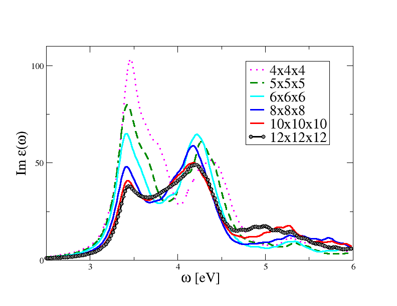

### **0\. Foreword**

The ABINIT project is a group effort of dozens of people worldwide, whose
central outcome is the main ABINIT application, delivered with many other
files in the ABINIT package. The ABINIT project includes also resources
provided on the [ABINIT Web site](http://www.abinit.org) and the 
[ABINIT Github repository](https://github.com/abinit).

```
markdown admonition

!!! warning
    text
```

!!! warning
    Before reading the present file, and get some grasp about the main ABINIT
    application, you should get some theoretical background. In case you have
    already used another electronic structure code, or a quantum chemistry code,
    it might be sufficient to read the introduction of the paper ``Iterative
    minimization techniques for ab initio total-energy calculations: molecular
    dynamics and conjugate gradients'' M. C. Payne, M. P. Teter, D. C. Allan, T.
    A. Arias, and J. D. Joannopoulos, Rev. Mod. Phys. 64, 1045-1097 (1992).
    If you have never used another electronic structure code or a Quantum
    Chemistry package, you should complete such reading by going (at your own
    pace) through the Chaps. 1 to 13 , and appendices L and M of the book
    Electronic Structure. Basic Theory and Practical Methods. R. M. Martin.
    Cambridge University Press (2004) ISBN 0 521 78285 6.

After having gone through the present New User's Guide, you should follow the
ABINIT tutorial ([[lesson_welcome]]).

```
modal
\{!tests/v1/Input/t01.in!\}
```

{!tests/v1/Input/t01.in!}

```
wiki links
[[ecut]]
```

This is a link to the [[ecut]] input variable.

```
citations:
[[Allen1976]]
```

Link to [[Allen1976]] paper

```
Mathjax support
```

$$ G(12) = -i \langle \Theta^N_0|T\bigl[\Psi(1)\Psi^\dagger(2)\bigr]|\Theta^N_0 \rangle \label{eq:GreenDef} $$

The propagator in Eq.\ref{eq:GreenDef} contains ...

Can include videos with:

```
[](https://asciinema.org/a/40324)
```

The video below gives an overwiew of the command line options of `runtests.py`

[](https://asciinema.org/a/40324)

Single editor

{!editor!}

Multi-tab editor

{!editors!}

Table

First Header  | Second Header
------------- | -------------
Content Cell  | Content Cell
Content Cell  | Content Cell


<p>Here's a simple Plotly plot - <a href="https://bit.ly/1Or9igj">plotly.js documentation</a></p>

<!-- Plots go in blank <div> elements. 
    You can size them in the plot layout, or give the div a size as shown here.
-->
<div id="plotly_plot" style="width:90%;height:250px;"></div>

<script>
$(function() {
    Plotly.plot(document.getElementById('plotly_plot'), [{
        x: [1, 2, 3, 4, 5],
        y: [1, 2, 4, 8, 16] }], 
        {margin: {t: 0}} 
    );
});
</script>


<div class="plotly-graph-div" id="abinit_stats_plot" style="width:90%;height:750px;"></div>

<script>
$(function() {
    Plotly.d3.json("statistics.json", function(stats) {
        var mode = "lines+markers";
        var x = stats.dates;
        var trace1 = {x: x, y: stats.num_f90lines, mode: mode, name: "Number of F90 lines"};
        var trace2 = {x: x, y: stats.num_f90files, mode: mode, name: "Number of F90 files", yaxis: 'y2'};
        var trace3 = {x: x, y: stats.num_tests, mode: mode, name: "Number of tests", yaxis: 'y3'};
        var trace4 = {x: x, y: stats.targz_sizes, mode: mode, name: "Tarball size [Mb]",  yaxis: 'y4'};
        var data = [trace1, trace2, trace3, trace4];

        var layout = {
          //title: "Date released: date mentioned in the release notes",
          //xaxis: {tickvals: stats.date, ticktex: stats.version},
          legend: {traceorder: 'reversed'},
          yaxis: {domain: [0, 0.25]},
          yaxis2: {domain: [0.25, 0.5]},
          yaxis3: {domain: [0.5, 0.75]},
          yaxis4: {domain: [0.75, 1.0]}
        };

        Plotly.newPlot(document.getElementById('abinit_stats_plot'), data, layout, {showLink: false});
    });
});
</script>


<div id="d9605599-cb1c-4129-8b19-17ce6aba5726" style="height:480px;width:90%;" class="plotly-graph-div"></div>
<script type="text/javascript">
$(function() {
window.PLOTLYENV=window.PLOTLYENV || {};window.PLOTLYENV.BASE_URL="https://plot.ly";Plotly.newPlot("d9605599-cb1c-4129-8b19-17ce6aba5726", [{"type": "scatter", "mode": "lines", "name": "_no_legend_", "x": [0.0, 1.0, 2.0, 3.0, 4.0, 5.0, 6.0, 7.0, 8.0, 9.0, 10.0, 11.0, 12.0, 13.0], "y": [-9.535926813037863, -9.876226298320375, -10.502626380975554, -11.072275270653648, -11.500111086492925, -11.762235917752008, -11.855994211486859, -11.76251819341731, -11.504916691387299, -11.070253355567209, -10.472515698483473, -9.71204808431639, -8.806419420709936, -7.770857742644391], "xaxis": "x1", "yaxis": "y1", "line": {"color": "rgba (0, 0, 0, 1)", "width": 2.0, "dash": "solid"}}, {"type": "scatter", "mode": "lines", "name": "_no_legend_", "x": [0.0, 1.0, 2.0, 3.0, 4.0, 5.0, 6.0, 7.0, 8.0, 9.0, 10.0, 11.0, 12.0, 13.0], "y": [-6.932409107339495, -6.434802934828302, -5.322605919575588, -3.9285157520893517, -2.3945043688503773, -0.8733724958309406, -0.00014030772164197458, -0.5571414588100456, -1.6673511132234293, -2.899043741948111, -4.183072223655675, -5.430789440546145, -6.638317765955847, -7.770857742385957], "xaxis": "x1", "yaxis": "y1", "line": {"color": "rgba (0, 0, 0, 1)", "width": 2.0, "dash": "solid"}}, {"type": "scatter", "mode": "lines", "name": "_no_legend_", "x": [0.0, 1.0, 2.0, 3.0, 4.0, 5.0, 6.0, 7.0, 8.0, 9.0, 10.0, 11.0, 12.0, 13.0], "y": [-1.2052164496157305, -1.1554489594350494, -1.0092171418411153, -0.7665270717175385, -0.4528182065705968, -0.1428083923944694, -0.00014030759373184765, -0.3277545491196321, -0.9723569008401443, -1.6065630675314715, -2.136905062657105, -2.5280226397179906, -2.7655709939700346, -2.8450316563515354], "xaxis": "x1", "yaxis": "y1", "line": {"color": "rgba (0, 0, 0, 1)", "width": 2.0, "dash": "solid"}}, {"type": "scatter", "mode": "lines", "name": "_no_legend_", "x": [0.0, 1.0, 2.0, 3.0, 4.0, 5.0, 6.0, 7.0, 8.0, 9.0, 10.0, 11.0, 12.0, 13.0], "y": [-1.205216449452264, -1.1554489592807489, -1.0092171416994509, -0.766527071585184, -0.4528182064492583, -0.14280839226344, -0.00014030753353200254, -0.3277545490275573, -0.9723569007113824, -1.606563067405498, -2.136905062531706, -2.5280226395887833, -2.7655709938391246, -2.8450316562198195], "xaxis": "x1", "yaxis": "y1", "line": {"color": "rgba (0, 0, 0, 1)", "width": 2.0, "dash": "solid"}}, {"type": "scatter", "mode": "lines", "name": "_no_legend_", "x": [0.0, 1.0, 2.0, 3.0, 4.0, 5.0, 6.0, 7.0, 8.0, 9.0, 10.0, 11.0, 12.0, 13.0], "y": [1.3452986249904786, 1.3958960083306966, 1.554143482033659, 1.8234355899681942, 2.1778240885941402, 2.4977796128290306, 2.5316876738983813, 2.319469275580544, 1.8326610232363585, 1.3141284521215777, 0.8826582161745025, 0.6005397907672814, 0.5241993687224857, 0.6740354382714466], "xaxis": "x1", "yaxis": "y1", "line": {"color": "rgba (0, 0, 0, 1)", "width": 2.0, "dash": "solid"}}, {"type": "scatter", "mode": "lines", "name": "_no_legend_", "x": [0.0, 1.0, 2.0, 3.0, 4.0, 5.0, 6.0, 7.0, 8.0, 9.0, 10.0, 11.0, 12.0, 13.0], "y": [3.3660083208212663, 3.412354076289877, 3.505815644595171, 3.4859551031061207, 3.180459228387515, 2.7429763968895218, 2.53168767399785, 2.973060435992415, 3.924172942325165, 3.566106899388532, 2.562611320842353, 1.690136780454158, 1.0555238517809453, 0.6740354390091046], "xaxis": "x1", "yaxis": "y1", "line": {"color": "rgba (0, 0, 0, 1)", "width": 2.0, "dash": "solid"}}, {"type": "scatter", "mode": "lines", "name": "_no_legend_", "x": [0.0, 1.0, 2.0, 3.0, 4.0, 5.0, 6.0, 7.0, 8.0, 9.0, 10.0, 11.0, 12.0, 13.0], "y": [3.3660083208735943, 3.412354076350133, 3.505815644666348, 3.485955103188201, 3.180459228480861, 2.7429763970025123, 2.531687674066167, 2.9730604361332746, 3.9241729424268685, 5.0785623964957916, 6.285164566512434, 7.570141740247583, 8.869464699917046, 9.764008865347613], "xaxis": "x1", "yaxis": "y1", "line": {"color": "rgba (0, 0, 0, 1)", "width": 2.0, "dash": "solid"}}, {"type": "scatter", "mode": "lines", "name": "_no_legend_", "x": [0.0, 1.0, 2.0, 3.0, 4.0, 5.0, 6.0, 7.0, 8.0, 9.0, 10.0, 11.0, 12.0, 13.0], "y": [7.486356378802683, 7.55668857436073, 7.557830014133407, 6.52220627429504, 5.08025478643014, 3.6442503425509143, 2.895269759022862, 3.4202361151243847, 4.0978111233925025, 5.078562399289727, 6.2851656462748275, 7.570142181409012, 8.869464784778696, 9.76406100597167], "xaxis": "x1", "yaxis": "y1", "line": {"color": "rgba (0, 0, 0, 1)", "width": 2.0, "dash": "solid"}}], {"width": 640, "height": 480, "autosize": false, "hovermode": "closest", "margin": {"l": 80, "r": 63, "t": 57, "b": 52, "pad": 0}, "xaxis1": {"anchor": "y1", "zeroline": false, "ticks": "inside", "type": "linear", "range": [0.0, 13.0], "showgrid": true, "domain": [0.0, 1.0], "side": "bottom", "tickfont": {"size": 12.0}, "tick0": 0, "dtick": 6, "tickmode": false, "mirror": "ticks", "showline": true}, "yaxis1": {"anchor": "x1", "zeroline": false, "ticks": "inside", "type": "linear", "range": [-12.936996972359786, 10.845063766844596], "showgrid": true, "domain": [0.0, 1.0], "side": "left", "tickfont": {"size": 10.0}, "nticks": 7, "mirror": "ticks", "showline": true, "title": "Energy [eV]", "titlefont": {"size": 10.0, "color": "#000000"}}, "showlegend": false}, {"showLink": true, "linkText": "Export to plot.ly"})
});
</script>

* * *

### **1\. Introduction**


<div id="myCarousel" class="carousel slide" data-ride="carousel">
  <!-- Indicators -->
  <ol class="carousel-indicators">
    <li data-target="#myCarousel" data-slide-to="0" class="active"></li>
    <li data-target="#myCarousel" data-slide-to="1"></li>
  </ol>

  <!-- Wrapper for slides -->
  <div class="carousel-inner" role="listbox">
    <div class="item active">
      
      <div class="carousel-caption">
        <h3>Unconverged BSE optical spectrum</h3>
        <!-- <p>LA is always so much fun!</p> -->
      </div>
    </div>

    <div class="item">
      
      <div class="carousel-caption">
        <h3>Convergengeof BSE optical spectrum wrt k-point sampling</h3>
        <!-- <p>Thank you, Chicago!</p> -->
      </div>
    </div>
  </div>

  <!-- Left and right controls -->
  <a class="left carousel-control" href="#myCarousel" role="button" data-slide="prev">
    <span class="glyphicon glyphicon-chevron-left" aria-hidden="true"></span>
    <span class="sr-only">Previous</span>
  </a>
  <a class="right carousel-control" href="#myCarousel" role="button" data-slide="next">
    <span class="glyphicon glyphicon-chevron-right" aria-hidden="true"></span>
    <span class="sr-only">Next</span>
  </a>
</div>


ABINIT is a package whose main program allows to find the total energy, charge
density and electronic structure of systems made of electrons and nuclei
(molecules and periodic solids) within Density Functional Theory, using
pseudopotentials and a planewave basis, or augmented plane waves, or even
wavelets. Some possibilities of ABINIT go beyond Density Functional Theory,
i.e. the many-body perturbation theory (GW approximation the Bethe-Salpether
equation), Time-Dependent Density Functional Theory, Dynamical Mean-Field
Theory, the Allen-Heine-Cardona theory to find temperature-dependent
electronic structure. ABINIT also includes options to optimize the geometry
according to the DFT forces and stresses, or to perform molecular dynamics
simulation using these forces, or to generate dynamical (vibrations - phonons)
properties, dielectric properties, mechanical properties, thermodynamical
properties, etc . In addition to the main ABINIT code, different utility
programs are provided.

We suppose that you have downloaded the ABINIT package from the Web site,
unpacked it and installed it. If not, you might nevertheless continue reading
the present Web page, just to get an overview, but it might prove more
fruitful to have first downloaded the ABINIT package and at least unpacked it,
see the [installation notes](http://www.abinit.org/installation).

We will use the name "~abinit" to refer to the directory that contains the
ABINIT package after download. In practice, a version number is appended to
this name, to give for example : abinit-8.4.0 . The ABINIT package versioning
scheme is explained later in this file.

~abinit contains different subdirectories. For example, the present file, as
well as other descriptive files, should be found in ~abinit/doc/users . Other
subdirectories will be described later.

* * *

### **2\. The ABINIT executable : abinit. **

After compilation, the main code will be present in the package as
~abinit/src/98_main/abinit (or perhaps at another place, depending on your
installation).

To run abinit you need four things:

  - Access to the executable, abinit. 
  - An input file. 
  - A files file (list of file names in a file). 
  - A pseudopotential input file for each kind of element in the unit cell. 

With these items a job can be run.

The full list of input variables, all of which are provided in the single
input file, is given in the ABINIT [[allvariables]].  
The detailed description of input variables is given in many "VAR*" files,
including:

  - Basic variables, [[varbas]]
  - Ground-state calculation variables, [[vargs]]
  - GW variables, [[vargw]]
  - Files handling variables, [[varfil]]
  - Parallelisation variables, [[varpar]]
  - Response Function variables, [[varrf]]
  - ... 

A set of examples aimed at guiding the beginner is available in the tutorial
([[lesson_welcome]]).

Other test cases (more than 800 input files) can be found in the ~abinit/test
subdirectories, e.g. "fast", the "vX" series (v1, v2, ... v67mbpt, v7, v8),
"libxc", "paral", the "tutoX" series ...

Many different sorts of pseudopotentials can be used with ABINIT. Most of them
can be found on the [atomic data
files](http://www.abinit.org/downloads/atomic-data-files) page of the ABINIT
web site. There are official recommended pseudopotentials tables (the PAW JTH
table, and the norm-conserving table from ONCVPSP), and also some older sets
of pseudopotentials. A subset of existing pseudopotentials are used for test
cases, and are located in the ~abinit/tests/Psps_for_tests directory, but they
are not recommended for production. Information on pseudopotential files can
be found in the [ABINIT help file](help_abinit.html#5) and the ~abinit/doc/psp_infos directory.

* * *

### **3\. Other programs in the ABINIT package.**

In addition to abinit, there are utility programs provided in the ABINIT
package.

Some utility programs are written in F90 (like the main abinit program), and
their sources is also in ~abinit/src/98_main .  
These include : **mrgddb**, **anaddb**, **aim**, **conducti**, **optics**,
**mrgscr**, **cut3d**, and **fold2Bloch**.

**mrgddb** and **anaddb** allow to post-process responses to atomic displacements and/or to homogeneous electric field, and/or to strain perturbation, as generated by abinit, to produce full phonon band structures, thermodynamical functions, piezoelectric properties, superconducting properties, to name a few. "mrgddb" is for "Merge of Derivative DataBases", while "anaddb" is for "Analysis of Derivative DataBases". 

**cut3d** can be used to post-process the three-dimensional density (or potential) files generated by abinit. It allows one to deduce charge density in selected planes (for isodensity plots), along selected lines, or at selected points. It allows one also to make the Hirshfeld decomposition of the charge density in "atomic" contributions. 

**fold2Bloch** is used for unfolding of first-principle electronic band structure obtained with ABINIT code. 

**aim** is also a post-processor of the three-dimensional density files generated by abinit. It performs the Bader Atom-In-Molecule decomposition of the charge density in "atomic" contributions. 

**conducti** allows one to compute the frequency-dependent optical conductivity. 

Some utility programs are not written in F90, but in Python. They are
contained in ~abinit/scripts, where post-processing (numerous tools) and pre-
processing scripts are distinguished. Some allows one to visualize ABINIT
outputs, like abinit_eignc_to_bandstructure.py .

* * *

### **4\. Other resources outside the ABINIT package.**

In addition to the ABINIT package, other resources can be obtained from the
[ABINIT GitHub site](https://github.com/abinit). The sources of the latest
version of the ABINIT package are actually mirrored on this site, but for
other resources (not in the package) this is the only download point.

**abipy** is an open-source library for analyzing the results produced by ABINIT (including visualisation), and for preparing input files and workflows to automate ab-initio calculations (so-called high-throughput calculations). It provides interface with pymatgen, developed by the Materials Project. Links for AbiPy : <https://github.com/abinit/abipy>, and [http://abinit.github.io/abipy](http://abinit.github.io/abipy/). 

The **pseudo-dojo** is a Python framework for generating and validating
pseudopotentials (or PAW atomic data files). Normal ABINIT users benefit a lot
from this project, since the ABINIT recommended table of norm-conserving
pseudopotentials has been generated thanks to it, while the PAW recommended
table is under control of it. Albeit, only specialized ABINIT experts use it.

**abiconfig** is a holding area for configuration files used to configure/compile Abinit on clusters. You might benefit from it if you have indeed to install Abinit on a cluster. 

**abiconda** contains conda recipes to build Abinit-related packages (like AbiPy). You might benefit from it if you install Abipy on your machine. 

**abiflows** provides flows for high-throughput calculations with ABINIT. 

In addition to the resources that the ABINIT developer provide to the
community through the ABINIT packages, portal and Github, many ABINIT-
independent commercial or free applications can be used to visualize ABINIT
outputs or interact with ABINIT. We provide a (not very well maintained) list
of links in <http://www.abinit.org/community/links>. Of course, you might get
more by browsing the Web...

* * *

### **5\. Input variables to abinit.**

As an overview, the most important input variables, to be provided in the
input file, are listed below:
    
Specification of the geometry of the problem, and types of atoms :

[[natom]]
: total number of atoms in unit cell

[[ntypat]]
: number of types of atoms

[[typat]] ([[natom]])
: sequence of integers, specifying the type of each atom.
!!! note
    the atomic coordinates ([[xangst]], [[xcart]] or [[xred]])
    must be specified in the same order

[[rprim]] (3,3)
: unscaled primitive translations of periodic cell;
  each COLUMN of this array is one primitive translation

[[xangst]] (3,[[natom]])
: cartesian coordinates (Angstrom) of atoms in unit cell
  NOTE: only used when [[xred]] and [[xcart]] are absent

[[xcart]] (3,[[natom]])
: cartesian coordinates (Bohr) of atoms in unit cell
  NOTE: only used when [[xred]] and [[xangst]] are absent

[[xred]] (3,[[natom]])
: fractional coordinates for atomic locations;
  NOTE: leave out if [[xangst]] or [[xcart]] is used

[[znucl]] ([[ntypat]])
: Nuclear charge of each type of element; must agree with
  nuclear charge found in psp file.

Specification of the planewave basis set, Brillouin zone wavevector sampling, and occupation of the bands:

[[ecut]]
: planewave kinetic energy cutoff in Hartree

[[kptopt]]
: option for specifying the k-point grid
  if [[kptopt]]=1, automatic generation, using ngkpt and shiftk.
  (for the latter, see the [help_abinit](help_abinit.html) file)

[[ngkpt]] (3)
: dimensions of the three-dimensional grid of k-points

[[occopt]]
: set the occupation of electronic levels:
    =1 for semiconductors
    =3 ... 7  for metals

Specification of the type of calculation to be done:

[[ionmov]]
: when [[ionmov]] = 0 : the ions and cell shape are fixed
                  = 2 : search for the equilibrium geometry
                  = 6 : molecular dynamics

[[iscf]]
: either a positive number for defining self-consistent
  algorithm (usual), or -2 for band structure in fixed potential

[[optdriver]]
: when == 3 and 4 : will do GW calculations (many-body perturbation theory)

[[rfelfd]]
: when /= 0 : will do response calculation to electric field

[[rfphon]]
: when = 1 : will do response calculation to atomic displacements

Specification of the numerical convergency of the calculation:

[[nstep]]
: maximal number of self-consistent cycles (on the order of 20)

[[tolvrs]]
: tolerance on self-consistent convergence

[[ntime]]
: number of molecular dynamics or relaxation steps

[[tolmxf]]
: force tolerance for structural relaxation in Hartree/Bohr

* * *

### ** 6\. Output files.**

Output from an abinit run shows up in several files and in the standard
output. Usually one runs the command with a pipe of standard output to a log
file, which can be inspected for warnings or error messages if anything goes
wrong or otherwise can be discarded at the end of a run. The more easily
readable formatted output goes to the output file whose name is given in the
"files" file, i.e. you provide the name of the formatted output file. No error
message is reported in the latter file. On the other hand, this is the file
that is usually kept for archival purposes.

In addition, wavefunctions can be input (starting point) or output (result of
the calculation), and possibly, charge density and/or electrostatic potential,
if they have been asked for. These three sets of data are stored in
unformatted files.  
The Density Of States (DOS) can also be an output as a formatted (readable)
file.  
An analysis of geometry can also be provided (GEO file)  
The name of these files is constructed from a "root" name, that must be
different for input files and output files, and that is provided by the user,
to which the code will append a descriptor, like WFK for wavefunctions, DEN
for the density, POT for the potential, DOS for the density of states ...

There are also different temporary files. A "root" name should be provided by
the user, from which the code generates a full name. Amongst these files,
there is a "status" file, summarizing the current status of advancement of the
code, in long jobs. The [ABINIT help file](help_abinit.html) contains more details.

* * *

### ** 7\. What does the code do?**

The simplest sort of job computes an electronic structure for a fixed set of
atomic positions within a periodic unit cell. By electronic structure, we mean
a set of eigenvalues and wavefunctions which achieve the lowest (DFT) energy
possible for that basis set (that number of planewaves). The code takes the
description of the unit cell and atomic positions and assembles a crystal
potential from the input atomic pseudopotentials, then uses either an input
wavefunction or simple gaussians to generate the initial charge density and
screening potential, then uses a self-consistent algorithm to iteratively
adjust the planewave coefficients until a sufficient convergence is reached in
the energy.

Analytic derivatives of the energy with respect to atomic positions and unit
cell primitive translations yield atomic forces and the stress tensor. The
code can optionally adjust atomic positions to move the forces toward zero and
adjust unit cell parameters to move toward zero stress. It can performs
molecular dynamics. It can also be used to find responses to atomic
displacements and homogeneous electric field, so that the full phonon band
structure can be constructed...

* * *

### ** 8\. Versioning logic.**

We finish this "new user guide" with a brief explanation of the logic of
ABINIT version releases.

The full name of a version has three digits (for example, 8.4.0). The first
digit is the slowly varying one (in average, it is changed after two or three
years). It indicates the major efforts and trends in that version. At the
level of 1.x.y ABINIT (before 2000 !), the major effort was placed on the
"ground-state" properties (total energy, forces, geometry optimisation,
molecular dynamics ...). With version 2.x.y , response-function features
(phonons, dielectric response, effective charges, interatomic force constants
...) were included. The main additional characteristics of version 3.x.y were
the distribution under the GNU General Public Licence, the set-up of the
documentation and help to the user through the Web site in html format, and
the availability of GW capabilities. The version 4.x.y put a lot of effort in
the speed of ABINIT (e.g. PAW), and its parallelisation. These historical
developments explain why the tests are gathered in directories "v1", "v2",
"v3", etc. Every 4 to 8 months, we release a "production version" of ABINIT in
which the second digit, an even number, is incremented, which usually goes
with additional features. A release notes document is issued, with the list of
additional capabilities, and other information with respect to modifications
with the previous release. The odd second digits are used for internal
management only, so-called "development versions" of ABINIT (for example
8.5.0). Two versions differing by the last (third) digit have the same
capabilities, but the one with the largest last digit is more debugged than
the other : version 8.4.1 is more debugged than 8.4.0, but no new features has
been added (so likely, no additional bug!).


* * *

In order to start using ABINIT, please follow the tutorial
([[lesson_welcome]])
